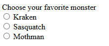

# [Formulário](https://developer.mozilla.org/en-US/docs/Web/HTML/Element#forms)

- [Formulário](#formulário)
  - [``<Form>`` O Formulário](#form-o-formulário)
    - [``accept-charset``](#accept-charset)
    - [``autocapitalize``](#autocapitalize)
    - [``autocomplete``](#autocomplete)
    - [``name``](#name)
    - [``rel``](#rel)
    - [Atributos de Envio](#atributos-de-envio)
    - [``action``](#action)
    - [``method``](#method)
    - [``enctype``](#enctype)
    - [``novalidate``](#novalidate)
    - [``target``](#target)
    - [Exemplo](#exemplo)
  - [``<Input>`` A Entrada](#input-a-entrada)
    - [``button``](#button)
    - [``checkbox``](#checkbox)
    - [``color``](#color)
    - [``date``](#date)
    - [``datetime-local``](#datetime-local)
    - [``email``](#email)
    - [``file``](#file)
    - [``hidden``](#hidden)
    - [``image``](#image)
    - [``month``](#month)
    - [``number``](#number)
    - [``password``](#password)
    - [``radio``](#radio)
    - [``range``](#range)
    - [``reset``](#reset)
    - [``search``](#search)
    - [``submit``](#submit)
    - [``tel``](#tel)
    - [``text``](#text)
    - [``time``](#time)
    - [``url``](#url)
    - [``week``](#week)
    - [Atributos](#atributos)
    - [Non - Stardard](#non---stardard)
    - [Metodos](#metodos)
    - [``checkValidity()``](#checkvalidity)
    - [``reportValidity()``](#reportvalidity)
    - [``setCustomValidity('mensagem')``](#setcustomvaliditymensagem)
    - [``select()``](#select)
    - [``setRangeText('replacement')``](#setrangetextreplacement)
    - [``setSelectionRange(start, end)``](#setselectionrangestart-end)
    - [``showPicker()``](#showpicker)
    - [``stepDown()`` | ``stepUp()``](#stepdown--stepup)
  - [``<Label>`` O Rótulo](#label-o-rótulo)
  - [``<Button>`` O Botão](#button-o-botão)
    - [Atributos](#atributos-1)
    - [``name``](#name-1)
    - [``value``](#value)
    - [``autofocus``](#autofocus)
    - [``disabled``](#disabled)
    - [``form``](#form)
    - [``type``](#type)
    - [``formaction``](#formaction)
    - [``formectype``](#formectype)
    - [``formmethod``](#formmethod)
    - [``formtarget``](#formtarget)
  - [``<textarea>`` O Bloco de Texto](#textarea-o-bloco-de-texto)
    - [Atributos](#atributos-2)
    - [``autocapitalize``](#autocapitalize-1)
    - [``autocomplete``](#autocomplete-1)
    - [``autofocus``](#autofocus-1)
    - [``cols``](#cols)
    - [``dirname``](#dirname)
    - [``disabled``](#disabled-1)
    - [``form``](#form-1)
    - [``maxlength`` | ``minlength``](#maxlength--minlength)
    - [``placeholder``](#placeholder)
    - [``readonly``](#readonly)
    - [``required``](#required)
    - [``rows``](#rows)
    - [``spellcheck``](#spellcheck)
    - [``wrap``](#wrap)
    - [Atributuos não-padrão](#atributuos-não-padrão)
    - [``autocorrect``](#autocorrect)
  - [``<legend>`` A Legenda](#legend-a-legenda)
  - [``<fieldset> O Conjuto da obra``](#fieldset-o-conjuto-da-obra)
    - [Atributos](#atributos-3)
    - [``disabled``](#disabled-2)
    - [``form``](#form-2)
    - [``name``](#name-2)
  - [``<datalist>`` A Lista de Dados](#datalist-a-lista-de-dados)
    - [Tipos](#tipos)
    - [``Data e Hora``](#data-e-hora)
    - [``Range``](#range-1)
    - [``Color``](#color-1)
    - [Password](#password-1)
  - [``<meter>`` O Medidor](#meter-o-medidor)
    - [Atributos](#atributos-4)
    - [``value``](#value-1)
    - [``min``](#min)
    - [``max``](#max)
    - [``low``](#low)
    - [``high``](#high)
    - [``optimum``](#optimum)
    - [``form``](#form-3)
  - [``<progress>`` O Indicador de Progresso](#progress-o-indicador-de-progresso)
    - [Atributos](#atributos-5)
    - [max](#max-1)
    - [value](#value-2)
  - [``<option>`` As Opções](#option-as-opções)
    - [Atributos](#atributos-6)
    - [``disabled``](#disabled-3)
    - [``label``](#label)
    - [``selected``](#selected)
    - [``value``](#value-3)
  - [``<select>`` O Selecionar](#select-o-selecionar)
    - [Atributos](#atributos-7)
    - [``autocomplete``](#autocomplete-2)
    - [``autofocus``](#autofocus-2)
    - [``disabled``](#disabled-4)
    - [``form``](#form-4)
    - [``multiple``](#multiple)
    - [``name``](#name-3)
    - [``required``](#required-1)
    - [``size``](#size)
    - [Example](#example)
  - [``<optgroup>`` O Grupo de Opções](#optgroup-o-grupo-de-opções)
    - [Atributos](#atributos-8)
    - [``disabled``](#disabled-5)
    - [``label``](#label-1)
  - [``<output>`` O Container de Saída](#output-o-container-de-saída)
    - [Atributos](#atributos-9)
    - [``for``](#for)
    - [``form``](#form-5)
    - [``name``](#name-4)
    - [Exemplo](#exemplo-1)

## [``<Form>``](https://developer.mozilla.org/en-US/docs/Web/HTML/Element/form) O Formulário

[Padrão HTML](https://html.spec.whatwg.org/multipage/forms.html#the-form-element)


```html
<form action="" method="get" class="form-example">
	<div class="form-example">
    	<label for="name">Enter your name: </label>
		<input type="text" name="name" id="name" required />
	</div>

	<div class="form-example">
		<label for="email">Enter your email: </label>
		<input type="email" name="email" id="email" required />
	</div>

	<div class="form-example">
    	<input type="submit" value="Subscribe!" />
	</div>
</form>
```

### ``accept-charset``

[``Character encoding``](https://www.w3.org/International/articles/definitions-characters/) o valor padrão é o mesmo da página

```html
<form accept-charset="utf-8, utf-16, ...">
```

### ``autocapitalize``

### [``autocomplete``](https://developer.mozilla.org/en-US/docs/Web/HTML/Attributes/autocomplete)

- O browser autocompleta os valores.
- [``Valores especificos``](https://developer.mozilla.org/en-US/docs/Web/HTML/Attributes/autocomplete#values).

    ```html
    <form action="/submit" method="post" autocomplete="on">
    	<label for="username">Nome de Usuário:</label>
        <input type="text" id="username" name="username">

        <label for="password">Senha:</label>
        <input type="password" id="password" name="password">

        <button type="submit">Login</button>
    </form>
    ```

### ``name``

### [``rel``](https://developer.mozilla.org/en-US/docs/Web/HTML/Attributes/rel)

- mó preguiça. clica no titulo ai
  - ``noopener``: Indica que o navegador não deve permitir que a nova página acessada possa acessar o objeto window.opener.
  - ``noreferrer``: Indica que o navegador não deve enviar informações de referência ao URL especificado na ação do formulário.
  - ``nofollow``: Embora mais comumente associado a links, nofollow pode ser usado para indicar que a submissão do formulário não deve influenciar os rankings de busca.

### [Atributos de Envio](https://developer.mozilla.org/en-US/docs/Web/HTML/Element/form#attributes_for_form_submission)

Controlam o comportamento do envio.

### ``action``

URL que o ``method`` vai enviar.

### ``method``

[``Método HTTP``](https://developer.mozilla.org/en-US/docs/Web/HTTP)

- [``POST``](https://developer.mozilla.org/en-US/docs/Web/HTTP/Methods/POST): envia os dados como um [``request body``](https://developer.mozilla.org/en-US/docs/Web/API/Request/body).

    ```html
    <form action="/login" method="post">
        <label for="email">Email:</label>
        <input type="email" id="email" name="email" required>

        <label for="password">Senha:</label>
        <input type="password" id="password" name="password" required>

        <button type="submit">Entrar</button>
    </form>
    ```

- [``GET``](https://developer.mozilla.org/en-US/docs/Web/HTTP/Methods/GET): Busca um item.

    ```html
    <form action="/busca" method="get">
        <label for="termo">Termo de busca:</label>
        <input type="text" id="termo" name="termo" required>
        
        <button type="submit">Buscar</button>
    </form>
    ```

- [``PUT``](https://developer.mozilla.org/en-US/docs/Web/HTTP/Methods/PUT): Solicita a modificação de um item.

    ```html
    <form action="/perfil/123" method="put">
        <label for="nome">Nome:</label>
        <input type="text" id="nome" name="nome" value="João Silva">

        <label for="email">Email:</label>
        <input type="email" id="email" name="email" value="joaosilva@email.com">

        <button type="submit">Salvar</button>
    </form>
    ```

- [``DELETE``](https://developer.mozilla.org/en-US/docs/Web/HTTP/Methods/DELETE): Solicita a exclusão de um item.

    ```html
    <form action="/itens/123" method="delete">
        <button type="submit">Excluir item</button>
    </form>
    ```

### [``enctype``](https://developer.mozilla.org/en-US/docs/Web/HTML/Element/form#enctype)

Define o [``MIME type``](https://developer.mozilla.org/en-US/docs/Web/HTTP/Basics_of_HTTP/MIME_types)

- ``application/x-www-form-urlencoded``: Padrão.
  - Os dados são codificados como uma série de pares ``chave-valor``, separados por ``&``, onde os espaços são convertidos em ``+`` e caracteres especiais são codificados.
  - ``name=John+Doe&email=john.doe%40example.com``.

- ``multipart/form-data``: Envia arquivos ou Binários.
  - enviado em blocos separados, com delimitador único, e cada parte pode ter seu próprio ``Content-Type``.

    ```html
    <form action="/upload" method="post" enctype="multipart/form-data">
        <label for="name">Nome:</label>
        <input type="text" id="name" name="name">
        <br>

        <label for="file">Arquivo:</label>
        <input type="file" id="file" name="file">
        <br>

        <input type="submit" value="Enviar">
    </form>
    ```

- ``text/plain``: envia em ``txt`` separado por linhas. somente para debug.

### ``novalidate``

Desativa a validação automatica do navegador como ``required``.

### [``target``](https://developer.mozilla.org/en-US/docs/Web/HTML/Element/form#target)

Define onde a ``resp`` do servidor deve ser exibida.

- ``_self``: Envia o form e abre na mesma janela. Valor padrão.

- ``_blanck``: Abre em uma nova aba. util quando está dentro de ``<iframe>`` ou similar.

- ``_parent``: Abre na janela pai, caso exista

- ``_top``: Abre em janela inteira, removendo todos os frames, caso exista.

- ``<nome_do_frame>``: abre no frame especificado.

### Exemplo

```html
<form method="get">
    <label>
        Name:
        <input name="submitted-name" autocomplete="name" />
    </label>
    <button>Save</button>
</form>

<form method="post">
    <label>
        Name:
        <input name="submitted-name" autocomplete="name" />
    </label>
    <button>Save</button>
</form>

<form method="post">
    <fieldset>
        <legend>Do you agree to the terms?</legend>
        <label><input type="radio" name="radio" value="yes" /> Yes</label>
        <label><input type="radio" name="radio" value="no" /> No</label>
    </fieldset>
</form>
```


## [``<Input>``](https://developer.mozilla.org/en-US/docs/Web/HTML/Element/input) A Entrada

<input type="text" id="name" name="name" required minlength="1" maxlength="9" size="11" placeholder="formulario"/>

```html
<input type="text" id="name" name="name" required minlength="1" maxlength="9" size="11" placeholder="formulario"/>
```

### [``button``](https://developer.mozilla.org/en-US/docs/Web/HTML/Element/input/button)

```html
<input type="button" value="butão"/>
```

### [``checkbox``](https://developer.mozilla.org/en-US/docs/Web/HTML/Element/input/checkbox)

```html
<input type="checkbox" checked/>
```

### [``color``](https://developer.mozilla.org/en-US/docs/Web/HTML/Element/input/color)

```html
<input type="color" value=#ab3456/>
```

### [``date``](https://developer.mozilla.org/en-US/docs/Web/HTML/Element/input/date)
  
- [``value="Date String Format"``](https://developer.mozilla.org/en-US/docs/Web/HTML/Date_and_time_formats#date_strings)

    ```html
    <input type="date" value="2001-09-11"/>
    ```

### [``datetime-local``](https://developer.mozilla.org/en-US/docs/Web/HTML/Element/input/datetime-local)

```html
<input type="datetime-local" value="2001-09-11T08:46"/>
```

### [``email``](https://developer.mozilla.org/en-US/docs/Web/HTML/Element/input/email)

- [Validar email](https://developer.mozilla.org/en-US/docs/Web/HTML/Element/input/email#validation)

    ```html
    <input 
    type="email" pattern=".+exemplo\.com" 
    size="30" maxlength="64" 
    required
    placeholder="Insira o seu melhor email" />
    ```

### [``file``](https://developer.mozilla.org/en-US/docs/Web/HTML/Element/input/file)

- [Receber Arquivos](https://developer.mozilla.org/en-US/docs/Web/API/File_API/Using_files_from_web_applications#getting_information_about_selected_files)

- [accept](https://developer.mozilla.org/en-US/docs/Web/HTML/Element/input#accept)

    ```html
    <input type="file" id="avatar" name="avatar" accept="image/png, image/jpeg" />
    ```

### [``hidden``](https://developer.mozilla.org/en-US/docs/Web/HTML/Element/input/hidden)

```html
<input type="hidden"/>
```

### [``image``](https://developer.mozilla.org/en-US/docs/Web/HTML/Element/input/image)

- [``alt``](https://developer.mozilla.org/en-US/docs/Web/HTML/Element/input#alt)
- [formaction](https://developer.mozilla.org/en-US/docs/Web/HTML/Element/input#formaction)

    ```html
    <input type="image" src="../assets/ein.png" alt="cachorrinho fofo">
    ```

### [``month``](https://developer.mozilla.org/en-US/docs/Web/HTML/Element/input/month)

```html
<input type="month" value="2001-11" />
```

### [``number``](https://developer.mozilla.org/en-US/docs/Web/HTML/Element/input/number)

```html
<input type="number" min="1" max= "9" value="11"/>
```

### [``password``](https://developer.mozilla.org/en-US/docs/Web/HTML/Element/input/password)

```html
<input type="password" placeholder="senha" minlength="8" required/>
```

### [``radio``](https://developer.mozilla.org/en-US/docs/Web/HTML/Element/input/radio)

```html
<form>
    <fieldset>
        <legend>Please select your preferred contact method:</legend>
        <div>
            <input type="radio" id="contactChoice1" name="contact" value="email" />
            <label for="contactChoice1">Email</label>

            <input type="radio" id="contactChoice2" name="contact" value="zapzap" />
            <label for="contactChoice2">ZapZap</label>

            <input type="radio" id="contactChoice3" name="contact" value="carta" />
            <label for="contactChoice3">Carta</label>
        </div>

        <div>
            <button type="submit">Submit</button>
        </div>
    </fieldset>
</form>
```

### [``range``](https://developer.mozilla.org/en-US/docs/Web/HTML/Element/input/range)
  
```html
<input type="range" name="volume" min="1" max="11" />
```

### [``reset``](https://developer.mozilla.org/en-US/docs/Web/HTML/Element/input/reset)

```html
<input type="text" size="25" placeholder="digite algo e aperte em Reset"/>
<input type="reset" value="Reset"/>
<input type="submit" value="Submit"/>
```

### [``search``](https://developer.mozilla.org/en-US/docs/Web/HTML/Element/input/search)

```html
<input type="search" name="q" placeholder="procure algo">
<button>Search</button>
```

### [``submit``](https://developer.mozilla.org/en-US/docs/Web/HTML/Element/input/submit)

```html
<input type="submit" value="Mandar" />
```

### [``tel``](https://developer.mozilla.org/en-US/docs/Web/HTML/Element/input/tel)

```html
<input type="tel" placeholder="01-2345-6789" size=10 pattern="[0-9]{2}-[0-9]{4}-[0-9]{4}" required />
```

### [``text``](https://developer.mozilla.org/en-US/docs/Web/HTML/Element/input/text)

```html
<input type="text" placeholder="texto simples" size=9>
```

### [``time``](https://developer.mozilla.org/en-US/docs/Web/HTML/Element/input/time)

```html
<input type="time" min="07:00" max="18:00" value="13:40"/>
```

### [``url``](https://developer.mozilla.org/en-US/docs/Web/HTML/Element/input/url)

```html
<input type="url" placeholder="https://clonarcartao.com" pattern="https://.*" size="30"/>
```

### [``week``](https://developer.mozilla.org/en-US/docs/Web/HTML/Element/input/week)

```html
<input type="week" min="2024-W18" max="2024-W26" required />
```

### [Atributos](https://developer.mozilla.org/en-US/docs/Web/HTML/Element/input#attributes)

- [``accept``](https://developer.mozilla.org/en-US/docs/Web/HTML/Element/input#accept) - Tipo: ``file``
- [``alt``](https://developer.mozilla.org/en-US/docs/Web/HTML/Element/input#alt) - Tipo: ``imagem``
- [``autocapitalize``](https://developer.mozilla.org/en-US/docs/Web/HTML/Global_attributes/autocapitalize)
- [``autocomplete``](https://developer.mozilla.org/en-US/docs/Web/HTML/Attributes/autocomplete)

    ```html
    <form action="/submit" method="post">
        <label for="username">Nome de Usuário:</label>
        <input type="text" id="username" name="username" autocomplete="username">

        <label for="password">Senha:</label>
        <input type="password" id="password" name="password" autocomplete="current-password">

        <button type="submit">Login</button>
    </form>
    ```

- ``autofocus``-  auto foca no formulario
- [``capture``](https://developer.mozilla.org/en-US/docs/Web/HTML/Element/input#capture) - Tipo: ``file``
- ``checked``
- [``dirname``](https://developer.mozilla.org/en-US/docs/Web/HTML/Attributes/dirname)
- ``disabled``
- [``form``](https://developer.mozilla.org/en-US/docs/Web/HTML/Element/input#form)
- [``formaction``](https://developer.mozilla.org/en-US/docs/Web/HTML/Element/input#formaction) - Tipo: ``Submit``
- ``height`` | ``width`` - Tipo: ``Image``
- ``id``
- [``inputmode``](https://developer.mozilla.org/en-US/docs/Web/HTML/Element/input#inputmode) - teclado virtual
- [``list``](https://developer.mozilla.org/en-US/docs/Web/HTML/Element/input#list) - sugestões
- ``min`` | ``max`` - Tipo: ``data e hora``
- ``maxlength`` | ``minlength`` - Tipo: ``texto``
- ``multiple`` - tipo: ``email`` e ``file``
- ``name``
- ``pattern`` - padrão texto.
- ``placeholder``
- ``readonly``
- ``required``
- ``size`` - tamanho em ``px``. da caixa do ``<form>``.
- ``src`` - Tipo: ``image``
- [``step``](https://developer.mozilla.org/en-US/docs/Web/HTML/Element/input#step) - Tipo ``data e hora``, ``range`` e ``numero``
- ``tabindex``
- ``title``
- ``type``
- ``value``

### [Non - Stardard](https://developer.mozilla.org/en-US/docs/Web/HTML/Element/input#non-standard_attributes)

Não estão incluso em todos os navegadores.

### [Metodos](https://developer.mozilla.org/en-US/docs/Web/HTML/Element/input#methods)

Providenciado por [``HTMLInputElement``](https://developer.mozilla.org/en-US/docs/Web/API/HTMLInputElement), representa os elementos de ``<input>`` em ``DOM``.

- [``HTMLElement``](https://developer.mozilla.org/en-US/docs/Web/API/HTMLElement)
- [``Element``](https://developer.mozilla.org/en-US/docs/Web/API/Element)
- [``Node``](https://developer.mozilla.org/en-US/docs/Web/API/Node)
- [``EventTarget``](https://developer.mozilla.org/en-US/docs/Web/API/EventTarget).

### [``checkValidity()``](https://developer.mozilla.org/en-US/docs/Web/API/HTMLInputElement/checkValidit)

RETURN: ``bool``; caso ``false``: [``invalidEvent``](https://developer.mozilla.org/en-US/docs/Web/API/HTMLInputElement/invalid_event)

### [``reportValidity()``](https://developer.mozilla.org/en-US/docs/Web/API/HTMLInputElement/reportValidity)

RETURN: ``bool``; caso ``false``: [``invalidEvent``](https://developer.mozilla.org/en-US/docs/Web/API/HTMLInputElement/invalid_event); caso não seja cancelado: reporta ao usuário.

### [``setCustomValidity('mensagem')``](https://developer.mozilla.org/en-US/docs/Web/API/HTMLInputElement/setCustomValidity)

PARAM: ``string``; define ``validityErrorMessage``.

### [``select()``](https://developer.mozilla.org/en-US/docs/Web/API/HTMLInputElement/select)

### [``setRangeText('replacement')``](https://developer.mozilla.org/en-US/docs/Web/API/HTMLInputElement/setRangeText)

substitui no range de ``<input>`` ou ``<textarea>``

- ``"start"``
- ``"end"``

- ``selectMode``:
  - ``"select"``: seleciona texto inserido mais recente
  - ``"start"``: move texto selecionado para antes do texto inserido
  - ``"end"``: mode texto selecionado para depois do texto inserido
  - ``"preserve"``: preserva o valor selecionado, definido por padrão

### [``setSelectionRange(start, end)``](https://developer.mozilla.org/en-US/docs/Web/API/HTMLInputElement/setSelectionRange)

Seleciona o texto no ``range``.

- ``direction``
  - ``'forward'``
  - ``'backward'``
  - ``'none'``: definido por padrão.

### [``showPicker()``](https://developer.mozilla.org/en-US/docs/Web/API/HTMLInputElement/showPicker)

Mostra ao usuario o elemento selecionado: ``date``, ``color`` ou ``file``.

### [``stepDown()``](https://developer.mozilla.org/en-US/docs/Web/API/HTMLInputElement/stepDown) | [``stepUp()``](https://developer.mozilla.org/en-US/docs/Web/API/HTMLInputElement/stepUp)

muito complicado lê a documentação ai.

## [``<Label>``](https://developer.mozilla.org/en-US/docs/Web/HTML/Element/label) O Rótulo


```html
<div class="preference">
    <label for="cheese">Do you like cheese?</label>
    <input type="checkbox" name="cheese" id="cheese" />
</div>

<div class="preference">
    <label for="peas">Do you like peas?</label>
    <input type="checkbox" name="peas" id="peas" />
</div>
```

não coloque elementos como ``<button>`` ou ``<a>``.


```html
<label for="tac">
    <input id="tac" type="checkbox" name="terms-and-conditions" />
    I agree to the Terms and Conditions
</label>
<p>
    <a href="terms-and-conditions.html">Read our Terms and Conditions</a>
</p>
```

## [``<Button>``](https://developer.mozilla.org/en-US/docs/Web/HTML/Element/button) O Botão

<button type="button">butão</button>

Envia o conteudo de ``form``

```html
<button type="button">butão</button>
```

Elementos que podem ser associados:

- [``<button>``](#button-o-botão)
- [``<input>``](#input-a-entrada)
- [``<meter>``](https://developer.mozilla.org/en-US/docs/Web/HTML/Element/meter)
- [``<output>``](https://developer.mozilla.org/en-US/docs/Web/HTML/Element/output)
- [``<progress>``](https://developer.mozilla.org/en-US/docs/Web/HTML/Element/progress)
- [``<select>``](https://developer.mozilla.org/en-US/docs/Web/HTML/Element/select)
- [``<textarea>``](https://developer.mozilla.org/en-US/docs/Web/HTML/Element/textarea)

### Atributos

### ``name``

### ``value``

### ``autofocus``

### ``disabled``

### [``form``](#form-o-formulário)

- Associa com o ``id`` de ``<form>`` do mesmo documento. Caso não exista associa com o ``<form>`` anterior

### [``type``](https://developer.mozilla.org/en-US/docs/Web/HTML/Element/button#type)

- ``submit``: Envia o conteudo de ``<form>``
- ``reset``: Funciona como ``<input type="reset">``
- ``button``: Não faz nada.

### [``formaction``](https://developer.mozilla.org/en-US/docs/Web/HTML/Element/button#formaction)

- ``type="submit"`` com o atributo ``formaction`` definido, mas sem um ``<form>`` associado, não faz nada. Você deve definir um proprietário de ``<form>``.

### [``formectype``](https://developer.mozilla.org/en-US/docs/Web/HTML/Element/button#formenctype)

- Caso seja do ``type="submit"``, especifica a formatação:
- ``application/x-www-form-urlencoded``: Definido por padrão.
- ``multipart/form-data``: Usado para enviar ``<input>`` com seu ``type="file"``.
- ``text/plain``: Especifico para debug, não deve ser usado.

### [``formmethod``](#method)

- caso não seja ``type="button"``, especifica o [``métodoHTTP``](https://developer.mozilla.org/en-US/docs/Web/HTTP/Methods).
- [``post``](https://www.rfc-editor.org/rfc/rfc9110#POST): Envia os dados de ``<form>``, informações confidenciais como login.
- [``get``](https://www.rfc-editor.org/rfc/rfc9110#GET): associado com ``<form action="">``
- ``dialog``: Indica que o botão fecha o ``<dialog>`` associado.

    ```html
    <form action="/submit" method="post">
        <button type="submit" formmethod="get">Enviar com GET</button>
        <button type="submit" formmethod="post">Enviar com POST</button>
    </form>
    ```

### [``formtarget``](#target)

- Caso seja ``type="submit"`` substitui o valor de ``target``
- ``_self``: Envia o form e abre na mesma janela. Valor padrão
- ``_blanck``: Abre em uma nova aba.
- ``_parent``: Abre na janela pai, caso exista
- ``_top``: Abre em janela inteira, removendo todos os frames, caso exista.
- ``<nome_do_frame>``: abre no frame especificado.

    ```html
    <form action="/submit" method="post">
        <button type="submit" formtarget="_self">Enviar no Mesmo Frame</button>
        <button type="submit" formtarget="_blank">Enviar em Nova Aba</button>
        <button type="submit" formtarget="_parent">Enviar no Frame Pai</button>
        <button type="submit" formtarget="_top">Enviar na Janela Inteira</button>
    </form>
    ```

> [!NOTE]
> Elementos ``<button>`` são muito mais fáceis de estilizar do que elementos ``<input>``. Você pode adicionar conteúdo HTML interno (como ``<i>``, ``<br>``, ou até ````), e usar pseudo-elementos ``::after`` e ``::before`` para renderizações complexas.
>Se seus botões não forem para enviar dados de formulário para um servidor, certifique-se de definir seu atributo ``type="button"``. Caso contrário, eles tentarão enviar dados do formulário e carregar a resposta (inexistente), possivelmente destruindo o estado atual do documento.
> Embora ``<button type="button">`` não tenha comportamento padrão, manipuladores de eventos podem ser programados para acionar comportamentos. Um botão ativado pode executar ações programáveis usando JavaScript, como remover um item de uma lista.

## [``<textarea>`` O Bloco de Texto](https://developer.mozilla.org/en-US/docs/Web/HTML/Element/textarea)


```html
<label for="story">Tell us your story:</label>

<textarea id="story" name="story" rows="5" cols="33">
It was a dark and stormy night...
</textarea>
```

### [Atributos](https://developer.mozilla.org/en-US/docs/Web/HTML/Element/textarea#attributes)

### [``autocapitalize``](#autocapitalize)

### [``autocomplete``](#autocomplete)

- ``on`` or ``off``

### [``autofocus``](#autofocus)

### [``cols``](https://developer.mozilla.org/en-US/docs/Web/HTML/Element/textarea#cols)

Largura visivel. Padrão: 20

### ``dirname``

### ``disabled``

### [``form``](#form)

- Associa com o ``id`` de um ``<form>``.

### ``maxlength`` | ``minlength``

### ``placeholder``

### ``readonly``

### ``required``

### [``rows``](https://developer.mozilla.org/en-US/docs/Web/HTML/Element/textarea#rows)

- Numero de linhas visiveis. Padrão: 2

### [``spellcheck``](https://developer.mozilla.org/en-US/docs/Web/HTML/Element/textarea#spellcheck)

- ``true``: Precisa ser escrevado corramente.
- ``default``
- ``false``

### [``wrap``](https://developer.mozilla.org/en-US/docs/Web/HTML/Element/textarea#wrap)

- ``hard``: O browser automaticamente insere (``CR+LF``) ao chegar na largura de: [``<cols>``](#cols)
- ``soft``: O browser assegura que todas as quebras de linha são ``CR+LF``, mas não adiciona a mais.
- > [!WARNING] off: é como soft, mas é horizontamente scrolavel.

### Atributuos não-padrão

### [``autocorrect``](https://developer.mozilla.org/en-US/docs/Web/HTML/Element/textarea#autocorrect)

- ``on`` or ``off``

## [``<legend>`` A Legenda](https://developer.mozilla.org/en-US/docs/Web/HTML/Element/legend)



```html
<legend>Choose your favorite monster</legend>

<input type="radio" id="kraken" name="monster" value="K" />
<label for="kraken">Kraken</label><br />

<input type="radio" id="sasquatch" name="monster" value="S" />
<label for="sasquatch">Sasquatch</label><br />

<input type="radio" id="mothman" name="monster" value="M" />
<label for="mothman">Mothman</label>
```

- Somente inclue os [Elementos Globais](https://developer.mozilla.org/en-US/docs/Web/HTML/Global_attributes)
- [Padrão HTML](https://html.spec.whatwg.org/multipage/form-elements.html#the-legend-element)

## [``<fieldset> O Conjuto da obra``](https://developer.mozilla.org/en-US/docs/Web/HTML/Element/fieldset)


```html
<form>
    <fieldset>
        <legend>Choose your favorite monster</legend>

        <input type="radio" id="kraken" name="monster" value="K" />
        <label for="kraken">Kraken</label><br />

        <input type="radio" id="sasquatch" name="monster" value="S" />
        <label for="sasquatch">Sasquatch</label><br />

        <input type="radio" id="mothman" name="monster" value="M" />
        <label for="mothman">Mothman</label>
    </fieldset>
</form>
```

### Atributos

### ``disabled``

desativa tudo dentro de ``<fieldset>``.

### ``form``

o uso disso é confuso.

### ``name``

o nome do conjunto.

## [``<datalist>`` A Lista de Dados](https://developer.mozilla.org/en-US/docs/Web/HTML/Element/datalist)

> [!WARNING] O FIREFOX SÓ TEM SUPORTE PARCIALMENTE.


```html
<label for="ice-cream-choice">Choose a flavor:</label>
<input list="ice-cream-flavors" id="ice-cream-choice" name="ice-cream-choice" />

<datalist id="ice-cream-flavors">
    <option value="Chocolate"></option>
    <option value="Coconut"></option>
    <option value="Mint"></option>
    <option value="Strawberry"></option>
    <option value="Vanilla"></option>
</datalist>
```

### [Tipos](https://developer.mozilla.org/en-US/docs/Web/HTML/Element/datalist#examples)

### [``Data e Hora``](https://developer.mozilla.org/en-US/docs/Web/HTML/Element/datalist#date_and_time_types)

- ``type=`` [``month``](#month), [``week``](#week), [``date``](#date), [``time``](#time), [``datetime-local``](#datetime-local).

```html
<input type="time" list="popularHours" />

<datalist id="popularHours">
    <option value="12:00"></option>
    <option value="13:00"></option>
    <option value="14:00"></option>
</datalist>
```

### ``Range``

```html
<label for="tick">Tip amount:</label>
<input type="range" list="tickmarks" min="0" max="100" id="tick" name="tick" />

<datalist id="tickmarks">
    <option value="0"></option>
    <option value="10"></option>
    <option value="20"></option>
    <option value="30"></option>
</datalist>
```

### ``Color``

```html
<label for="colors">Pick a color (preferably a red tone):</label>
<input type="color" list="redColors" id="colors" />

<datalist id="redColors">
    <option value="#800000"></option>
    <option value="#8B0000"></option>
    <option value="#A52A2A"></option>
    <option value="#DC143C"></option>
</datalist>
```

### Password

> [!WARNING] Até é possivel mas nenhum Browser suporta isso por motivos obveis.

## [``<meter>`` O Medidor](https://developer.mozilla.org/en-US/docs/Web/HTML/Element/meter)


```html
<label for="fuel">Fuel level:</label>

<meter id="fuel" 
min="0" max="100" 
low="33" high="66" 
optimum="80" value="50">at 50/100</meter>
```

### Atributos

### ``value``

### ``min``

### ``max``

### ``low``

### ``high``

### ``optimum``

### ``form``

## [``<progress>`` O Indicador de Progresso](https://developer.mozilla.org/en-US/docs/Web/HTML/Element/progress)


```html
<label for="file">File progress:</label>

<progress id="file" max="100" value="70">70%</progress>
```

### Atributos

### max

Padrão é 1, deve ser maior que 0 e **não tem ``min``**.

### value

Entre 0 e 1, ou entre 0 e ``max``.

## [``<option>`` As Opções](https://developer.mozilla.org/en-US/docs/Web/HTML/Element/option)

### Atributos

### ``disabled``

### ``label``

### [``selected``](https://developer.mozilla.org/en-US/docs/Web/HTML/Element/option#selected)

- Indica a opção inicialmente selecionada.

### ``value``

## [``<select>`` O Selecionar](https://developer.mozilla.org/en-US/docs/Web/HTML/Element/select)


```html
<label for="pet-select">Choose a pet:</label>

<select name="pets" id="pet-select">
    <option value="">--Please choose an option--</option>
    <option value="dog">Dog</option>
    <option value="cat">Cat</option>
    <option value="hamster">Hamster</option>
    <option value="parrot">Parrot</option>
    <option value="spider">Spider</option>
    <option value="goldfish">Goldfish</option>
</select>
```

### Atributos

### ``autocomplete``

### ``autofocus``

### ``disabled``

### ``form``

### [``multiple``](https://developer.mozilla.org/en-US/docs/Web/HTML/Element/select#multiple)

- Multiplas opções podem ser selecionadas,

### ``name``

### ``required``

### [``size``](https://developer.mozilla.org/en-US/docs/Web/HTML/Element/select#size)

- Numero de linhas visiveis ao mesmo tempo.

### Example


```html
<label for="hr-select">Your favorite food</label> <br />

<select name="foods" id="hr-select">
    <option value="">Choose a food</option>
    <hr />

    <optgroup label="Fruit">
        <option value="apple">Apples</option>
        <option value="banana">Bananas</option>
        <option value="cherry">Cherries</option>
        <option value="damson">Damsons</option>
    </optgroup>
    <hr />

    <optgroup label="Vegetables">
        <option value="artichoke">Artichokes</option>
        <option value="broccoli">Broccoli</option>
        <option value="cabbage">Cabbages</option>
    </optgroup>
    <hr />

    <optgroup label="Meat">
        <option value="beef">Beef</option>
        <option value="chicken">Chicken</option>
        <option value="pork">Pork</option>
    </optgroup>
    <hr />

    <optgroup label="Fish">
        <option value="cod">Cod</option>
        <option value="haddock">Haddock</option>
        <option value="salmon">Salmon</option>
        <option value="turbot">Turbot</option>
    </optgroup>
</select>
```

## [``<optgroup>`` O Grupo de Opções](https://developer.mozilla.org/en-US/docs/Web/HTML/Element/optgroup)


```html
<label for="dino-select">Choose a dinosaur:</label>

<select id="dino-select">
    <optgroup label="Theropods">
        <option>Tyrannosaurus</option>
        <option>Velociraptor</option>
        <option>Deinonychus</option>

    </optgroup>
        <optgroup label="Sauropods">
        <option>Diplodocus</option>
        <option>Saltasaurus</option>
        <option>Apatosaurus</option>
    </optgroup>
</select>
```

### Atributos

### ``disabled``

### ``label``

## [``<output>`` O Container de Saída](https://developer.mozilla.org/en-US/docs/Web/HTML/Element/output)

### Atributos

### [``for``](https://developer.mozilla.org/en-US/docs/Web/HTML/Element/output#for)

### ``form``

### ``name``

### Exemplo


```html
<form oninput="result.value=parseInt(a.value)+parseInt(b.value)">
    <input type="range" id="b" name="b" value="50" /> +
    <input type="number" id="a" name="a" value="10" /> =
    <output name="result" for="a b">60</output>
</form>
```
