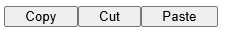

# Text Content

- [Text Content](#text-content)
  - [``<p>`` Parágrafo](#p-parágrafo)
  - [``<hr/>`` Horizontal Rule](#hr-horizontal-rule)
  - [``<div>`` Divisão](#div-divisão)
  - [``<blockquote>`` Citação em Bloco](#blockquote-citação-em-bloco)
  - [``<li>`` List Item](#li-list-item)
    - [``value=""``](#value)
  - [``<ol>`` Ordered List](#ol-ordered-list)
    - [``reversed``](#reversed)
    - [``start``](#start)
    - [``type``](#type)
  - [``<ul>`` Unordered List](#ul-unordered-list)
    - [``<menu>`` Menu](#menu-menu)
  - [``<figure>`` Figura](#figure-figura)
    - [``<figcaption>`` Legenda da Figura](#figcaption-legenda-da-figura)
  - [``<pre>`` Pré-Formatado](#pre-pré-formatado)
  - [``<dl>`` Description List](#dl-description-list)
  - [``<dt>`` Description Term](#dt-description-term)
    - [``<dd>`` Description Details](#dd-description-details)

## [``<p>``](https://developer.mozilla.org/en-US/docs/Web/HTML/Element/p) Parágrafo

## [``<hr/>``](https://developer.mozilla.org/en-US/docs/Web/HTML/Element/hr) Horizontal Rule

Representa uma quebra temática entre ``<p>``: por exemplo, uma mudança de cenário em uma história ou uma mudança de tópico dentro de uma seção.

```html
<p>A primeira regra da Oficina do Bolo é: você não comenta sobre a Oficina do Bolo.</p>
<hr />

<p>A segunda regra da Oficina do Bolo é: <b>você não comenta sobre a Oficina do Bolo.<b></p>
```

## [``<div>``](https://developer.mozilla.org/en-US/docs/Web/HTML/Element/div) Divisão

``<div>`` não representa nada por si só.

É usado para agrupar conteúdo para ser facilmente estilizado usando atributos (como ``class`` e ``id``) ou marcando uma seção de um documento como escrita em um idioma diferente (usando ``lang``) e assim por diante.

> [!NOTE]
> O elemento ``<div>`` deve ser usado somente quando nenhum outro elemento semântico (como ``<article>`` ou ``<nav>``) for apropriado.

## [``<blockquote>``](https://developer.mozilla.org/en-US/docs/Web/HTML/Element/blockquote) Citação em Bloco

É renderizado por recuo.

Uma *URL* para a fonte da citação pode ser fornecida atraves de ``cite=""``, enquanto uma representação textual da fonte pode ser fornecida usando ``<cite>``.

<blockquote cite="https://br.ifunny.co/">
    <p>Eu sabo.</p>
    <footer>—Albert Einstein <cite>Choquei</cite></footer>
</blockquote>

```html
<blockquote cite="https://br.ifunny.co/">
    <p>Eu sabo.</p>
    <footer>—Albert Einstein <cite>Choquei</cite></footer>
</blockquote>
```

---

## [``<li>``](https://developer.mozilla.org/en-US/docs/Web/HTML/Element/ol) List Item

Usados em: [unordered list ``<ul>``](#ul-unordered-list), [ordered list ``<ol>``](#ol-ordered-list) e em [menu ``<menu>``](#menu-menu).

### ``value=""``

Indica a ordem em [ordered list ``<ol>``](#ol-ordered-list).

Aceita apenas numeros inteiros.

> [!NOTE]
> Os itens da lista não ordenada são exibidos com um marcador, o seu estilo é definido no `CSS` usando a propriedade `list-style-type`.
>
> `<ul>` e `<ol>` podem ser aninhados tão profundamente quanto desejado. E as listas aninhadas podem alternar entre `<ol>` e `<ul>` sem restrições.

## [``<ol>``](https://developer.mozilla.org/en-US/docs/Web/HTML/Element/ol) Ordered List

<ol type=I start=3>
  <li>Misture a farinha, o fermento, o açúcar e o sal.</li>
  <li>Em outra tigela, misture os ovos, o leite e o óleo.</li>
  <li>Mexa as duas misturas.</li>
  <li>Encha 3/4 da bandeja.</li>
  <li>Asse durante 20 minutos.</li>
</ol>

```html
<ol type=I start=3>
  <li>Misture a farinha, o fermento, o açúcar e o sal.</li>
  <li>Em outra tigela, misture os ovos, o leite e o óleo.</li>
  <li>Mexa as duas misturas.</li>
  <li>Encha 3/4 da bandeja.</li>
  <li>Asse durante 20 minutos.</li>
</ol>
```

### ``reversed``

boolean que especifica que os itens da lista estão na ordem inversa. Os itens serão numerados de maior para menor.

### ``start``

Um número inteiro para iniciar a contagem dos itens da lista.

Sempre um algarismo arábico (1, 2, 3, etc.)

### ``type``

- ``1`` Números (Padrão)

- ``a`` | ``A`` Letras Minúsculas | Maiúsculas

- ``i`` | ``I`` Algarismos Romano Minúsculos | Maiúsculos

O tipo especificado é usado para a lista inteira.

## [``<ul>``](https://developer.mozilla.org/en-US/docs/Web/HTML/Element/ol) Unordered List

- Ovo
- Leite
  - Iogurte
  - Queijo
    - Mussarela
    - Coalho
    - Prato
  - Requeijão
- Pão

```html
<ul>
    <li>Ovo</li>
    <li>Leite
    <ul>
        <li>Iogurte</li>
        <li>Queijo
        <ul>
            <li>Mussarela</li>
            <li>Coalho</li>
            <li>Prato</li>
        </ul>
        </li>
        <li>Requeijão</li>
    </ul>
    </li>
    <li>Pão</li>
</ul>
```

### [``<menu>``](https://developer.mozilla.org/en-US/docs/Web/HTML/Element/ol) Menu

É uma alternativa semântica ao ``<ul>``.

É tratado pelos navegadores (e exposto através da árvore de acessibilidade) como não diferente de ``<ul>``.

Representa uma lista não ordenada de itens.



```html
<menu style="display: flex; list-style: none; padding: 0; width: 400px">
    <li style="flex-grow: 0.1"><button style="width: 100%" onclick="copy()">Copy</button></li>
    <li style="flex-grow: 0.1"><button style="width: 100%" onclick="cut()">Cut</button></li>
    <li style="flex-grow: 0.1"><button style="width: 100%" onclick="paste()">Paste</button></li>
</menu>
```

---

## [``<figure>``](https://developer.mozilla.org/en-US/docs/Web/HTML/Element/figure) Figura

Representa uma conteudo autocontido, com uma legenda opcional.

``<figure>``, ``<figcaption>`` e seu conteúdo são referenciados como uma única unidade.

``<figure>`` é uma imagem, ilustração, diagrama, trecho de código, etc., que é referenciada no fluxo principal de um documento, mas que pode ser movida para outra parte sem afetar o fluxo principal.

```html
<figure>
    <figcaption>Get browser details using <code>navigator</code>.</figcaption>
    <pre>
function NavigatorExample() {
    var txt;
    txt = "Browser CodeName: " + navigator.appCodeName + "; ";
    txt+= "Browser Name: " + navigator.appName + "; ";
    txt+= "Browser Version: " + navigator.appVersion  + "; ";
    txt+= "Cookies Enabled: " + navigator.cookieEnabled  + "; ";
    txt+= "Platform: " + navigator.platform  + "; ";
    txt+= "User-agent header: " + navigator.userAgent  + "; ";
    console.log("NavigatorExample", txt);
}
    </pre>
</figure>
```

### [``<figcaption>``](https://developer.mozilla.org/en-US/docs/Web/HTML/Element/figcaption) Legenda da Figura

## [``<pre>``](https://developer.mozilla.org/en-US/docs/Web/HTML/Element/pre) Pré-Formatado

``<pre>`` é um elemento de bloco que representa texto pré-formatado que vai ser apresentado exatamente como está escrito no arquivo HTML.

O texto normalmente é renderizado usando uma fonte não proporcional ou monoespaçada.

Uma combinação de ``<figure>`` e ``<figcaption>``, complementados pelos atributos [ARIA](https://developer.mozilla.org/en-US/docs/Web/Accessibility/ARIA) ``role`` e [``aria-label``](https://developer.mozilla.org/en-US/docs/Web/Accessibility/ARIA/Attributes/aria-label) no elemento ``<pre>``  permitem que a arte [ASCII](https://developer.mozilla.org/en-US/docs/Glossary/ASCII) pré-formatada seja anunciada como uma imagem com texto alternativo, e a ``figcaption`` servindo como legenda da imagem.

```html
<figure>
    <pre role="img" aria-label="ASCII COW">
        ____________________________________
    &lt; Sou uma especialista na minha área. &gt;
        ------------------------------------
            \   ^__^
            \   (oo)\_______
                (__)\       )\/\
                    ||----w |
                    ||     ||
    </pre>
    <figcaption id="cow-caption">
    Uma vaca dizendo: "Sou uma especialista na minha área." A vaca é ilustrada usando caracteres de texto pré-formatados.
    </figcaption>
</figure>
```

---

## [``<dl>``](https://developer.mozilla.org/en-US/docs/Web/HTML/Element/dl) Description List

Os usos comuns deste elemento são implementar um glossário ou exibir [metadados](Metadata.md#metaname) (uma lista de pares de ``valor-chave``).

## [``<dt>``](https://developer.mozilla.org/en-US/docs/Web/HTML/Element/dt) Description Term

### [``<dd>``](https://developer.mozilla.org/en-US/docs/Web/HTML/Element/dd) Description Details

Fornece a descrição, definição ou valor a (``<dt>``)

<div style="margin: 20px">
    <p>Criptídeos de Cornwall:</p>
    <dl>
        <dt>Besta de Bodmin</dt>
        <dd>Um grande felino que habita Bodmin Moor.</dd>
        <dt>Morgawr</dt>
        <dd>Uma serpente marinha.</dd>
        <dt>Owlman</dt>
        <dd>Uma criatura gigante parecida com uma coruja.</dd>
    </dl>
</div>

```html
<p>Criptídeos de Cornwall:</p>
<dl>
    <dt>Besta de Bodmin</dt>
    <dd>Um grande felino que habita Bodmin Moor.</dd>

    <dt>Morgawr</dt>
    <dd>Uma serpente marinha.</dd>

    <dt>Owlman</dt>
    <dd>Uma criatura gigante parecida com uma coruja.</dd>
</dl>
```
