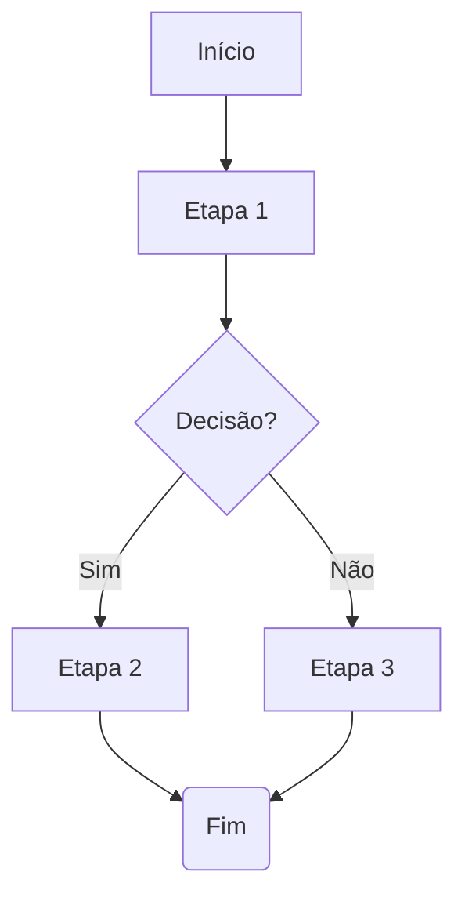
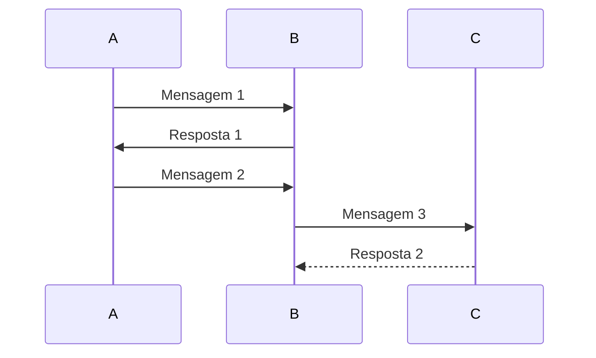
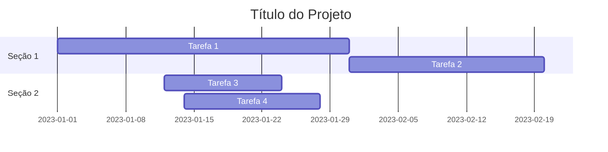
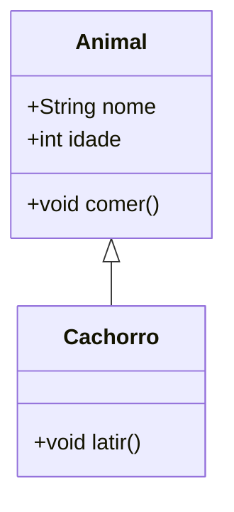
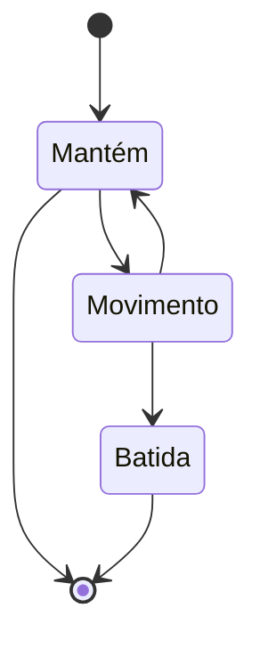
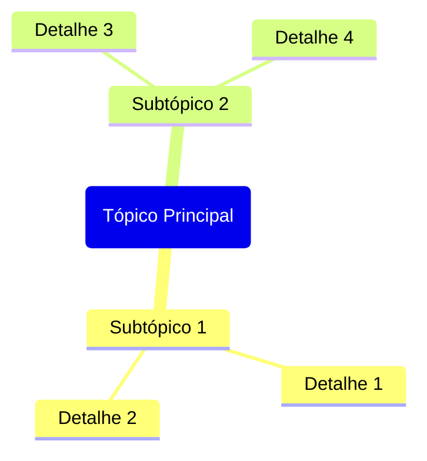
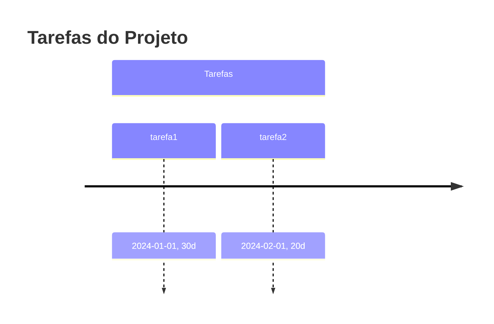

# [Mermaid](https://mermaid.js.org/intro/#diagram-types)

- [Mermaid](#mermaid)
  - [Gráficos de Fluxo](#gráficos-de-fluxo)
  - [Diagramas de Sequência](#diagramas-de-sequência)
  - [Diagramas de Gantt](#diagramas-de-gantt)
  - [Diagramas de Classe](#diagramas-de-classe)
  - [Diagramas de Estado](#diagramas-de-estado)
  - [Mind Map](#mind-map)
  - [Linha do tempo](#linha-do-tempo)

## [Gráficos de Fluxo](https://mermaid.js.org/syntax/flowchart.html?id=flowcharts-basic-syntax)

## [Diagramas de Sequência](https://mermaid.js.org/syntax/sequenceDiagram.html)

## [Diagramas de Gantt](https://mermaid.js.org/syntax/gantt.html)

## [Diagramas de Classe](https://mermaid.js.org/syntax/classDiagram.html)

## [Diagramas de Estado](https://mermaid.js.org/syntax/stateDiagram.html)

## [Mind Map](https://mermaid.js.org/syntax/mindmap.html)

## [Linha do tempo](https://mermaid.js.org/syntax/timeline.html)

